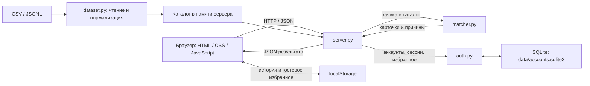

# Тойға — люди для вашего события

**Подбор event-подрядчиков с понятным объяснением каждого результата.** Проект для хакатон-задачи «Умный подбор подрядчиков #79-lite».

Тойға превращает каталог в короткий список: пользователь задаёт условия события и получает до трёх подходящих профилей с ценами, данными о занятости и причинами выбора. Приложение запускается локально, использует включённый в репозиторий каталог из **66 профилей** и не требует API-ключей.

> Текущая версия использует детерминированный алгоритм на правилах. AI-модели, LLM и семантический поиск в проекте не используются. Доступность и цены отражают данные каталога, а не подтверждение от подрядчика.

## 1. Какую проблему решает проект

Организатору свадьбы, тоя, корпоратива или другого события приходится вручную сопоставлять категории услуг, цены, форматы работы и занятость подрядчиков. Тойға помогает частным заказчикам и организаторам сократить этот поиск и понять, почему конкретный профиль подходит или исключён.

Решение предназначено для предварительного выбора: сравнить варианты, сохранить понравившиеся профили и обсудить подборку. Бронирование и связь с подрядчиками в текущей версии отсутствуют.

## 2. Что реализовано

| Возможность | Что получает пользователь |
|---|---|
| Подбор по семи параметрам | Город, дата, тип события, категория, бюджет, необязательные длительность и язык |
| Проверка условий | Исключение занятых, слишком дорогих и не подходящих по формату, языку или длительности профилей |
| До трёх рекомендаций | Карточки с именем, категорией, городом, ценой «от», описанием и объяснением выбора |
| Карточки и избранное | Горизонтальные карусели со свайпом, перетаскиванием мышью, стрелками и точками; клавиши ←/→ и Home/End при фокусе на ленте |
| Прозрачность результата | Число проверенных и подходящих профилей, список исключённых и причины исключения |
| Различение пустых результатов | Отдельные сообщения «нет категории в городе» и «профили есть, но никто не проходит условия» |
| Сравнение дат | Подбор по одной заявке на две даты и объяснение изменения первых трёх результатов |
| Альтернативные даты | До трёх подходящих дат в ближайшие 14 дней, если на выбранную дату совпадений нет |
| Сравнение подрядчиков | Таблица двух или трёх карточек текущей подборки: цена, остаток бюджета, языки, часы, форматы и происхождение данных |
| Подробный профиль | Большое окно с пятью разделами: описание, детали, календарь, условия подбора и происхождение данных; появление разделов при прокрутке |
| Переключение профилей | Стрелки внутри окна; на сенсорном экране — свайп по верхнему блоку, если в списке несколько профилей |
| Регистрация и вход | Аккаунт с именем, email и паролем; вход, просмотр данных аккаунта и выход |
| Избранное | В аккаунте сохраняется на сервере отдельно для пользователя и каталога; без входа — в текущем браузере |
| История | Пять последних выполненных подборок и восстановление заявки; отдельная история гостя и каждого аккаунта в браузере |
| Обмен подборкой | Копирование текста, скачивание `.txt`, ссылка с параметрами заявки |
| Подключение данных | Каталог CSV/JSONL задаётся при запуске сервера; служебный API импорта включается отдельно |
| Интерфейс | Яркая фиолетовая, оранжевая и лаймовая палитра, русский язык, адаптивная вёрстка, состояния загрузки и ошибок, идеи «Ведущие на свадьбу» и «Цветы для события» |
| Прокрутка страницы | Постепенное появление блоков, индикатор прогресса и переходы между этапами «Начало», «Событие», «Ваши люди» |

**Вход необязателен для подбора.** Гостевое избранное хранится в `localStorage`. После входа загружается список аккаунта из SQLite; он отделён от гостевого списка и избранного других пользователей. Автоматического переноса гостевого списка в аккаунт нет. После выхода снова доступен гостевой список.

История всегда хранится в `localStorage`: ключ учитывает каталог и, для вошедшего пользователя, ID аккаунта. После перезагрузки последняя выполненная заявка восстанавливается, а результат рассчитывается заново. Черновые изменения полей в историю не записываются. Если браузер запрещает постоянное хранение, история и гостевое избранное доступны только в текущем сеансе страницы.

После изменения условий интерфейс предлагает обновить подбор; сравнение и обмен результатом недоступны до его обновления. Ссылка содержит параметры заявки и идентификатор каталога, поэтому при изменении данных результат может отличаться.

При системной настройке уменьшения движения (`prefers-reduced-motion`) анимации и плавная прокрутка отключаются; блоки страницы и разделы профиля остаются доступными.

## 3. Как работает решение

### Пользовательский сценарий

1. Пользователь открывает сайт. Приложение получает сведения о каталоге и выполняет первую подборку: стандартную, последнюю сохранённую или заданную корректной ссылкой.
2. Пользователь заполняет форму и нажимает **«Подобрать подрядчиков»**.
3. Сервер проверяет заявку и отбирает профили нужного города и категории.
4. Из этого списка исключаются профили, которые не проходят хотя бы одно условие.
5. Оставшиеся профили сортируются, и браузер показывает до трёх карточек с объяснениями и диагностикой.
6. Пользователь изучает подробности, сравнивает варианты или даты, сохраняет профили в гостевое избранное либо входит в аккаунт для сохранения на сервере. Подборку можно скопировать или скачать.

### Входные данные

| Параметр | Условия в интерфейсе |
|---|---|
| Город | Обязательный; варианты берутся из текущего каталога, кроме значения «Зарубежье»; в исходном наборе доступны Алматы и Астана |
| Дата | Обязательная; с **23.09.2026 по 31.12.2026** включительно |
| Тип события | Свадьба, той, корпоратив, конференция, юбилей или день рождения |
| Категория | Обязательная; варианты берутся из текущего каталога |
| Бюджет | Целое число от 1 до 1 000 000 000 ₸ |
| Длительность | Необязательная; от 0,5 до 24 часов с шагом 0,5 |
| Язык | Необязательный; русский, казахский или английский |

### Фильтрация и ранжирование

Профиль проходит фильтры, если:

- город совпадает, а нужная категория присутствует в `categories`;
- выбранная дата отсутствует в `busy_dates`;
- `price_from_kzt` не превышает бюджет;
- тип события входит в `event_formats`;
- выбранный язык входит в `languages`, если язык указан;
- `max_hours` не меньше запрошенной длительности, если оба значения заданы.

**`max_hours: null` пропускает проверку длительности.** Это не обещание определённого количества часов работы.

Подходящие профили сортируются по ключу `(price_from_kzt, количество event_formats, id)` по возрастанию: сначала меньшая цена «от», при равной цене — меньшее число форматов, затем строковый ID. Число форматов используется как условная специализация, а не как рейтинг качества. В карточки попадают первые три профиля; если подходящих меньше, показываются все найденные.

Объяснение формируется шаблоном из полей заявки и профиля: цена, остаток бюджета, совпавшие условия и фрагмент исходного описания. Фрагмент выбирается по упоминанию формата события или из первой содержательной фразы и при необходимости сокращается. Новые утверждения о подрядчике не генерируются.

Повторный запрос к одному каталогу даёт тот же результат. Один профиль может нарушать несколько условий одновременно, поэтому сумма счётчиков причин может превышать число исключённых профилей.

Если исходный список по городу и категории непустой, но никто не подходит, алгоритм проверяет следующие 14 дней в пределах календарного окна и предлагает до трёх дат с совпадениями. Остальные параметры заявки сохраняются.

## 4. Технологии

| Компонент | Реализация |
|---|---|
| Сервер | **Python 3.9+**, стандартная библиотека: `http.server.ThreadingHTTPServer`, `argparse`, `threading`, `json`, `pathlib` |
| Загрузка данных | Стандартные модули Python `csv`, `io`, `json`; CSV и JSONL |
| Алгоритм | Python, фильтрация и стабильная сортировка; без обучения моделей |
| Интерфейс | HTML, CSS, обычный JavaScript; без frontend-фреймворка и сборщика |
| Обмен с сервером | Собственный HTTP API, JSON и браузерный `fetch` |
| Хранение | Каталог в памяти сервера; импорт в JSONL; аккаунты, сессии и избранное аккаунтов в SQLite; история и гостевое избранное в `localStorage` |
| Авторизация | Python `sqlite3`, `hashlib`, `hmac`, `secrets`; PBKDF2-HMAC-SHA256, серверные сессии и cookie |
| Анимации | CSS, `IntersectionObserver`, `MutationObserver` и `requestAnimationFrame`; учёт `prefers-reduced-motion` |
| Проверки | Python `unittest`; встроенный тестовый модуль Node.js `node:test` |
| Оформление | Шрифт Golos Text через Google Fonts; SVG-иконки в коде; локальная фотография |
| AI и внешние API | AI-модели, эмбеддинги, внешние API подбора и платные сервисы не подключены |

Для запуска приложения не нужны `pip install`, `npm install`, отдельный сервер базы данных или API-ключи. SQLite используется через стандартный модуль Python, файл базы создаётся автоматически. Node.js нужен только для дополнительных JavaScript-проверок.

## 5. Архитектура проекта



`server.py` раздаёт статические файлы, обрабатывает API и хранит активный каталог. `dataset.py` преобразует CSV/JSONL к общей структуре и использует проверку профилей из `matcher.py`. Функция `recommend` в `matcher.py` принимает каталог и заявку, возвращая результат без сетевых запросов. `auth.py` хранит аккаунты, сессии и списки избранного в SQLite. `static/app.js` управляет подбором и избранным, `static/account.js` — входом и регистрацией, `static/query-state.js` — параметрами истории и ссылок, `static/motion.js` — появлением блоков и этапами прокрутки.

```text
.
├── server.py                   # HTTP-сервер, API, состояние каталога
├── auth.py                     # Аккаунты, пароли, сессии, избранное, ограничение попыток
├── matcher.py                  # Валидация профилей и заявок, подбор, объяснения
├── dataset.py                  # Чтение CSV/JSONL и сериализация
├── generate_demo.py            # Генератор отдельного синтетического набора
├── data/
│   ├── hackathon.csv           # Исходный каталог: 66 профилей
│   ├── demo.jsonl              # Дополнительные 66 синтетических профилей
│   └── accounts.sqlite3        # Создаётся при запуске; исключён из Git
├── static/
│   ├── index.html              # Страница приложения
│   ├── styles.css              # Оформление и адаптивная вёрстка
│   ├── app.js                  # Подбор, карточки, сравнение и избранное
│   ├── account.js              # Формы регистрации, входа и аккаунта
│   ├── motion.js               # Появление блоков и навигация по этапам
│   ├── query-state.js          # Параметры заявки, история и ссылки
│   ├── favicon.svg             # Значок проекта
│   └── images/event-table.jpg  # Фотография главного экрана
└── tests/
    ├── test_matcher.py         # Проверки алгоритма
    ├── test_dataset.py         # Проверки загрузки и исходного каталога
    ├── test_auth.py            # Аккаунты, сессии, изоляция избранного и HTTP-обработчики
    ├── test_query_state.cjs    # Проверки истории, параметров и ссылок
    └── smoke_api.py            # Проверки работающего HTTP API
```

### HTTP API

| Метод | Маршрут | Назначение |
|---|---|---|
| GET | `/api/meta` | Размер и источник каталога, его ID, варианты фильтров, границы дат, счётчики флагов |
| POST | `/api/recommend` | Подбор по заявке |
| GET | `/api/auth/session` | Текущий пользователь в `user` или `null` |
| POST | `/api/auth/register` | Регистрация: `{"name":"Имя","email":"user@example.com","password":"…"}`; создаёт сессию |
| POST | `/api/auth/login` | Вход: `{"email":"user@example.com","password":"…"}`; создаёт сессию |
| POST | `/api/auth/logout` | Завершение текущей сессии; тело запроса `{}` |
| GET | `/api/account/favorites` | Избранное: `profiles`, `catalog_id`, `user_id`; требуется вход |
| POST | `/api/account/favorites` | Добавление или удаление: `{"action":"add","profile_id":"HK-42352","catalog_id":"…","expected_user_id":"…"}`; для удаления — `action: "remove"`; требуется вход |
| POST | `/api/import` | Импорт: `{"text":"содержимое файла","format":"csv"}` или `format: "jsonl"`; по умолчанию JSONL |
| POST | `/api/original` | Возврат к `data/hackathon.csv`; тело запроса `{}` |
| POST | `/api/demo` | Подключение `data/demo.jsonl`; тело запроса `{}` |

Ответ подбора содержит `status`, нормализованную заявку `query`, карточки `cards`, числа проверенных, подходящих и исключённых профилей, причины исключений и `alternative_dates`. Возможные статусы: `matched`, `no_category`, `no_matches`. Ошибки входных данных возвращаются с HTTP 400 и полем `error`, превышение размера JSON-запроса — с HTTP 413.

Маршруты `/api/import`, `/api/original` и `/api/demo` по умолчанию отвечают **HTTP 403**, в том числе вошедшим пользователям. Они доступны только при запуске с `--enable-data-tools`. В пользовательском интерфейсе управления каталогом нет.

GET и POST избранного возвращают полный актуальный список `profiles`, `catalog_id` и `user_id`. В POST обязателен `expected_user_id`, совпадающий с пользователем текущей сессии; отсутствие или несовпадение возвращает HTTP 409 с кодом `account_changed`. Интерфейс использует операции `add`/`remove`: чтение, изменение и сохранение списка выполняются под общей блокировкой сервера, чтобы действия из разных вкладок не перезаписывали остальные профили. Для API также поддержана полная замена списка: `{"catalog_id":"…","expected_user_id":"…","ids":["HK-42352"]}` без поля `action`.

Операции аккаунта используют JSON и cookie сессии. Неавторизованный доступ к избранному возвращает HTTP 401; повторный email или запись в устаревший каталог — 409; превышение числа попыток входа или регистрации — 429 с заголовком `Retry-After`. Тело запроса `/api/auth/*` ограничено 16 КиБ, остальных POST-запросов — 8 МиБ.

## 6. Установка и запуск

### Требования

- Python **3.9 или новее**.
- Браузер с поддержкой JavaScript.
- Git для клонирования; вместо клонирования можно использовать уже скачанную папку проекта.

### Шаг 1. Получить проект

```bash
git clone https://github.com/BAITC-Hacks/hack-9c881983-rabi-gulnaz.git
cd hack-9c881983-rabi-gulnaz
```

Если репозиторий уже открыт локально, перейдите в его корневую папку, где находится `server.py`.

### Шаг 2. Проверить Python и запустить сервер

```bash
python3 --version
python3 server.py
```

На Windows вместо `python3` можно использовать `py`. Установка дополнительных Python-пакетов не требуется.

### Шаг 3. Открыть приложение

Перейдите на **[http://127.0.0.1:8000](http://127.0.0.1:8000)**. По умолчанию загружается `data/hackathon.csv`, а в `data/accounts.sqlite3` автоматически создаются таблицы аккаунтов, сессий и избранного. Готовых аккаунтов и паролей в репозитории нет: новый аккаунт создаётся кнопкой **«Войти» → «Регистрация»**. Терминал с сервером должен оставаться открытым; остановка — `Ctrl+C`.

Если порт занят, запустите сервер на другом порту и откройте соответствующий адрес:

```bash
python3 server.py --port 8080
```

Адрес в этом случае: [http://127.0.0.1:8080](http://127.0.0.1:8080).

### Другой каталог

Для CSV или JSONL укажите путь к файлу:

```bash
python3 server.py --data /полный/путь/catalog.csv
python3 server.py --data /полный/путь/catalog.jsonl
```

Это альтернативные команды запуска; выберите одну. Отдельный демонстрационный набор подключается так:

```bash
python3 server.py --data data/demo.jsonl
```

Команда `python3 generate_demo.py` заново создаёт `data/demo.jsonl` с фиксированными seed. Для обычного запуска выполнять её не нужно: оба набора данных уже включены в репозиторий. Все параметры сервера доступны через `python3 server.py --help`.

### Служебное управление каталогом

Для локальной разработки можно включить API импорта и переключения наборов данных:

```bash
python3 server.py --enable-data-tools
```

При таком запуске доступны `/api/import`, `/api/demo` и `/api/original`. Дополнительной роли администратора у этих маршрутов нет; флаг предназначен для локальной разработки. В обычном запуске они отключены.

## 7. Как проверить решение — сценарий для жюри

### Демонстрация через интерфейс

Используйте **исходный каталог `data/hackathon.csv`**: запустите `python3 server.py` без `--data`. Если сервер уже работает с другим каталогом, остановите его и запустите этой командой снова. В пользовательском меню доступны подбор, избранное и аккаунт; технические разделы управления данными отсутствуют.

1. Нажмите готовый сценарий **«Ведущие на свадьбу»** под формой. Он установит Алматы, 17 октября 2026, свадьбу, категорию «Ведущий» и бюджет 1 000 000 ₸; язык и длительность останутся пустыми.
2. Убедитесь, что из 10 профилей в категории и городе подходят три: **Эмилия → Кики → Хаул**. Прочитайте объяснение в карточке и раскройте **«Почему показаны эти варианты?»**, чтобы увидеть причины исключения остальных.
3. Повторите подбор — порядок должен сохраниться. Пролистайте карточки стрелками или свайпом. Нажмите **«Сравнить варианты»** и сопоставьте цены и остаток бюджета.
4. Нажмите **«Открыть полный профиль»** в карточке и прокрутите его пять разделов. Переключитесь на соседний профиль стрелкой; на телефоне попробуйте свайп по верхнему цветному блоку. Закройте окно, чтобы вернуться к подборке.
5. Нажмите **«Сравнить с другой датой»**, выберите **18.10.2026** и нажмите **«Сравнить даты»**. В новой тройке будут **Мицури Канроджи → Кики → Сон Гоку**. Интерфейс объяснит изменения.
6. Попробуйте идею **«Цветы для события»**, затем вручную проверьте небольшой бюджет по таблице ниже. Прокрутите страницу: блоки появляются по мере просмотра, а навигация по этапам позволяет вернуться к условиям или результату.
7. Снова выберите **«Ведущие на свадьбу»**. Добавьте профиль в избранное, откройте **«Поделиться подборкой»** и скачайте `.txt`. После перезагрузки страницы последняя выполненная заявка должна восстановиться, если браузер разрешает локальное хранение.

| Сценарий | Параметры | Ожидаемый результат на исходном CSV |
|---|---|---|
| Ведущие на свадьбу | Алматы; 17.10.2026; свадьба; Ведущий; 1 000 000 ₸ | Эмилия (`HK-42352`, 900 000 ₸), Кики (`HK-35215`, 900 000 ₸), Хаул (`HK-77838`, 1 000 000 ₸); подходят 3 из 10 |
| Смена даты | Та же заявка, 18.10.2026 | Подходят 4 из 10; первые три — Мицури Канроджи (`HK-44923`), Кики (`HK-35215`), Сон Гоку (`HK-27222`) |
| Цветы для события | Алматы; 17.10.2026; свадьба; Флорист; 300 000 ₸; 6 ч | Тихиро Огино (`HK-90001`); второй флорист занят; `max_hours: null` не исключает первый профиль |
| Небольшой бюджет, вручную | Алматы; 17.10.2026; свадьба; Ведущий; 10 000 ₸ | `no_matches`: категория есть, но совпадений нет |
| Отсутствующий город, через API | Та же заявка на ведущего, `city: "Несуществующий город"` | `no_category`: нет исходного пула профилей |

Если в таблице не указаны язык или длительность, оставьте эти поля пустыми. Сценарии и ожидаемые имена относятся к исходному CSV, а не к `data/demo.jsonl`.

### Проверка аккаунта и избранного

1. Нажмите **«Войти» → «Регистрация»**. Введите имя, ранее не использованный email и пароль длиной от 8 до 128 символов, повторите пароль. После регистрации в шапке появится имя.
2. Выполните подбор и добавьте профиль в избранное. Перезагрузите страницу: аккаунт и избранное должны сохраниться.
3. Нажмите имя в шапке и **«Выйти из аккаунта»**. Снова войдите с тем же email и паролем: сохранённый список аккаунта должен восстановиться. Гостевой список хранится отдельно.
4. Для проверки изоляции создайте другой аккаунт с другим email: список первого пользователя в нём не появится.

### Проверка через API

При работающем сервере выполните в другом терминале:

```bash
curl http://127.0.0.1:8000/api/recommend \
  -H 'Content-Type: application/json' \
  -d '{"city":"Алматы","date":"2026-10-17","event_format":"свадьба","category":"Ведущий","budget":1000000,"hours":"","language":""}'
```

Ожидаются `status: "matched"`, `pool_count: 10`, `eligible_count: 3` и три карточки в указанном выше порядке.

### Автоматические проверки

Из корня репозитория:

```bash
python3 -m unittest discover -s tests -v
```

Python-тесты проверяют фильтры, три исхода подбора, детерминированность, смену даты, занятость площадок, границы бюджета, `null` в часах, альтернативные даты, CSV/JSONL и сохранение полей исходного каталога. Проверки аккаунтов охватывают хеширование паролей, регистрацию и вход, срок и отзыв сессий, изоляцию избранного по пользователям и каталогам, ограничения попыток и HTTP-обработчики. Для них используется временная SQLite-база, без изменения пользовательских аккаунтов.

При установленном Node.js с поддержкой `node --test`:

```bash
node --check static/app.js
node --check static/account.js
node --check static/motion.js
node --test tests/test_query_state.cjs
```

**14 JavaScript-тестов** проверяют параметры заявки, календарные даты, ссылки с кириллицей, некорректные и повторяющиеся URL-параметры, порядок и ограничение истории. Эти тесты не требуют работающего сервера.

Отдельная проверка HTTP API требует запущенного приложения и не меняет каталог:

```bash
python3 tests/smoke_api.py
```

Для другого порта передайте адрес: `python3 tests/smoke_api.py http://127.0.0.1:8080`.

## 8. Данные и интеграции

### Исходный каталог

Каталог по умолчанию — [`data/hackathon.csv`](data/hackathon.csv). Его состав проверяется тестами и чтением данных:

| Характеристика | Значение |
|---|---|
| Профилей | 66 |
| `synthetic: false` / `synthetic: true` | 53 / 13 |
| `city_imputed: true` | 8 |
| `price_imputed: true` | 18 |
| Города | Алматы — 50, Астана — 15, Зарубежье — 1 |
| Уникальных категорий | 17; у профиля может быть несколько категорий |

Значение **«Зарубежье» исключено из выбора города** и восстановления заявок в интерфейсе. Одна соответствующая запись сохранена в исходном CSV, поэтому число записей файла и серверного каталога остаётся равным 66. В интерфейсе исходного набора выбираются Алматы и Астана.

Флаги описывают происхождение данных в файле. `synthetic: false` отображается как **«Исходный профиль»** и не означает независимую проверку подрядчика. `city_imputed` и `price_imputed` отмечают дополненные город и цену; эти отметки видны в подробном профиле и таблице сравнения.

[`data/demo.jsonl`](data/demo.jsonl) — отдельный набор из **66 полностью синтетических профилей**, воспроизводимый через `generate_demo.py`. Он не подменяет исходный CSV при обычном запуске.

### Форматы и правила импорта

Общие поля профиля:

| Поле | Назначение и тип в JSONL |
|---|---|
| `id` | Уникальный идентификатор; строка или целое число, приводится к строке |
| `anon_name`, `city`, `description` | Непустые строки: имя для отображения, город, описание |
| `categories`, `event_formats` | Непустые массивы строк |
| `languages`, `busy_dates` | Массивы строк; могут быть пустыми; даты — `YYYY-MM-DD` |
| `price_from_kzt` | Конечное неотрицательное число — цена «от» в тенге |
| `max_hours` | Положительное число или `null`; при отсутствии — `null` |
| `synthetic`, `city_imputed`, `price_imputed` | Булевы флаги; при отсутствии — `false` |

В **CSV** первая строка содержит названия полей, столбцы разделяются запятыми, а элементы списков — символом `|`. Флаги записываются как `True`/`False` без учёта регистра; пустой `max_hours` превращается в `null`. Поддерживаются UTF-8 с BOM и без него, описания в кавычках с запятыми и переносами строк.

В **JSONL** каждая непустая строка — отдельный JSON-объект. Пример записи для импорта, не являющейся профилем исходного каталога:

```json
{"id":"example-001","anon_name":"Пример профиля","categories":["Ведущий"],"city":"Алматы","price_from_kzt":250000,"event_formats":["свадьба","той"],"languages":["русский","казахский"],"max_hours":6,"busy_dates":["2026-10-18"],"description":"Двуязычная программа с семейными церемониями.","synthetic":true,"city_imputed":false,"price_imputed":false}
```

Форматы и языки приводятся к нижнему регистру. Город и категория сопоставляются точно; синонимы и опечатки автоматически не исправляются. Допустимые типы события и языки заявки перечислены в разделе «Входные данные».

Каталог задаётся через `--data` либо импортируется через `/api/import` при включённом `--enable-data-tools`. Форма загрузки в пользовательском интерфейсе отсутствует. Ограничения: до **5 000 профилей**; весь JSON-запрос импорта — до **8 МиБ**. Весь набор проверяется перед переключением. Ошибка в данных сохраняет предыдущий активный каталог.

Успешный импорт:

- заменяет активный каталог для всех клиентов этого сервера;
- сохраняет нормализованные профили в `data/imported.jsonl` через временный файл и замену файла;
- меняет идентификатор каталога, если изменились нормализованные данные; серверное избранное и браузерная история привязаны к этому идентификатору.

Открытые вкладки следует обновить, чтобы синхронизировать сведения о каталоге. Избранное аккаунтов для прежних каталогов сохраняется в SQLite; запись со старым ID каталога отклоняется. Гостевое избранное при обнаружении другого каталога очищается. Файл `data/imported.jsonl` исключён из Git. Обычный перезапуск снова загружает исходный CSV; для продолжения работы с сохранённым импортом используйте:

```bash
python3 server.py --data data/imported.jsonl
```

### Аккаунты и хранение

`data/accounts.sqlite3` содержит пользователей, сессии и ID избранных профилей. База и служебные файлы SQLite `-wal`/`-shm` исключены из Git. Данные аккаунтов сохраняются между перезапусками сервера; история подборок в эту базу не записывается. При входе в тот же аккаунт на том же сервере загружается его избранное для активного каталога.

Регистрация проверяет имя длиной 2–80 символов, формат email и пароль длиной 8–128 символов. Email нормализуется без учёта регистра и должен быть уникальным. Подтверждение владения адресом не выполняется.

Реализованные меры для аккаунтов:

- Пароли сохраняются как PBKDF2-HMAC-SHA256 с индивидуальной случайной солью и 600 000 итераций, а не открытым текстом.
- Сессия выдаётся на семь дней; в SQLite хранится хеш токена. Выход отзывает текущую сессию. Cookie имеет `HttpOnly` и `SameSite=Lax`; на обычном локальном HTTP флаг `Secure` не устанавливается.
- Избранное проверяется по текущему пользователю и каталогу; неизвестные, повторяющиеся и устаревшие ID отклоняются.
- POST-запросы аккаунта требуют `application/json`. Сервер отклоняет запросы с чужим `Origin` или `Sec-Fetch-Site: cross-site`.
- Вход и регистрация ограничены суммарно 40 попытками с IP и 10 попытками для сочетания IP/email за 15 минут. Счётчики находятся в памяти одного процесса и сбрасываются при его перезапуске.

### Внешние ресурсы

Подбор не обращается к внешним сервисам. Интеграций с календарями подрядчиков, CRM, мессенджерами или платёжными системами нет.

Шрифт **Golos Text** загружается из **Google Fonts**; без доступа к нему используются резервные системные шрифты. Фотография главного экрана хранится локально в `static/images/event-table.jpg`; её атрибуция в интерфейсе — [Jonathan Borba / Unsplash](https://unsplash.com/photos/QvprbCoOkLY). Это оформление страницы, а не портфолио рекомендованных подрядчиков.

## 9. Ограничения текущей версии

- **Фиксированное календарное окно:** только 23 сентября — 31 декабря 2026 года. За его пределами заявка отклоняется. Обновления занятости в реальном времени нет.
- **Цена «от» не равна итоговой смете.** Отсутствие даты в `busy_dates` не подтверждает готовность подрядчика принять заказ.
- **Качество зависит от каталога:** есть синтетические профили и дополненные значения. Описания показываются как сведения из источника, без независимой проверки.
- **Подбор основан на правилах.** Свободный текст, семантический поиск, LLM, эмбеддинги, персонализация и рейтинг качества не реализованы. В выдаче максимум три профиля одной выбранной категории; полный состав команды события не рассчитывается.
- **Нет бронирований, заявок подрядчикам, оплаты и уведомлений.** История и гостевое избранное остаются в браузере; сервер хранит только избранное вошедших пользователей.
- **Аккаунты без подтверждения email, восстановления пароля и входа через социальные сервисы.** Редактирование и удаление аккаунта через интерфейс не реализованы. Локальная история разных аккаунтов разделена ключами, но не защищена от доступа к хранилищу самого браузера.
- **Каталог общий для одного сервера.** Служебный импорт заменяет его целиком. Каталог не хранится в SQLite; версионирования и автоматического восстановления последнего импорта при обычном запуске нет.
- **Локальный прототип:** используется стандартный HTTP-сервер Python. Production-конфигурация и настройка HTTPS отсутствуют. Служебные операции с каталогом по умолчанию отключены; при включении `--enable-data-tools` отдельная административная авторизация для них не предусмотрена.
- **Ссылка не фиксирует результат:** она передаёт заявку для нового расчёта. Адрес `127.0.0.1` работает только на том же компьютере при запущенном сервере; для обсуждения на другом устройстве можно передать текст или файл подборки.

## 10. Развёрнутая версия

**Ссылка на публично развёрнутую версию в репозитории не указана.** Конфигурации деплоя также нет.

Для демонстрации используйте локальный запуск и адрес **[http://127.0.0.1:8000](http://127.0.0.1:8000)**. Это локальная версия, а не публичный сайт.
